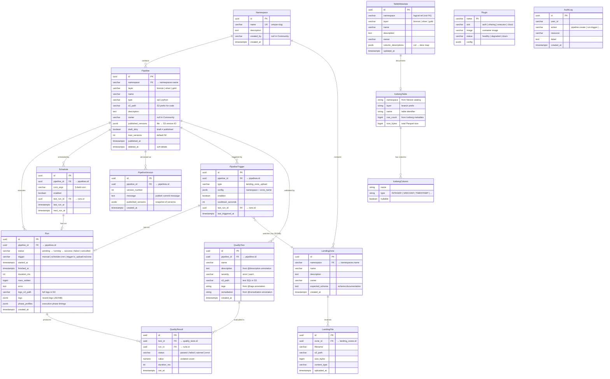
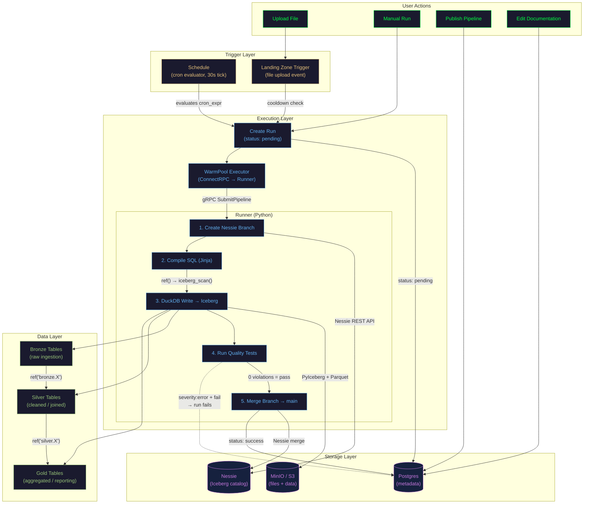
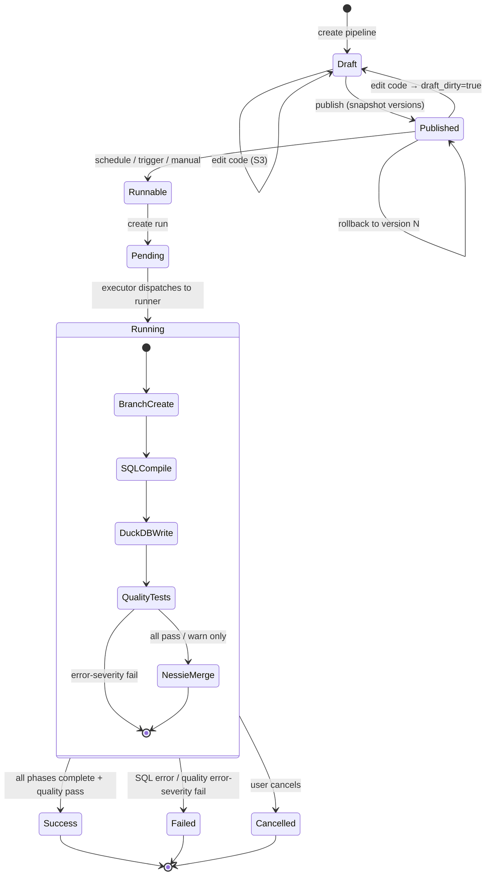

# Entity Relationship Diagram

> Complete DAG of all RAT v2 entities, their relationships, and data flows.

## Entity Relationship Diagram

## Data Flow DAG

## Pipeline Lifecycle

## Entity Counts & Storage Summary

| Entity | Storage | Cardinality | Notes |
|--------|---------|-------------|-------|
| **Namespace** | Postgres | 1 (Community) / N (Pro) | Top-level grouping |
| **Pipeline** | Postgres + S3 | Many per namespace | Code in S3, metadata in PG |
| **PipelineVersion** | Postgres | Many per pipeline | Immutable version snapshots |
| **Run** | Postgres + S3 | Many per pipeline | Logs in S3, status in PG |
| **Schedule** | Postgres | 0-N per pipeline | Cron-based triggers |
| **PipelineTrigger** | Postgres | 0-N per pipeline | Event-driven (LZ uploads) |
| **QualityTest** | Postgres + S3 | 0-N per pipeline | SQL in S3, metadata in PG |
| **QualityResult** | Postgres | 1 per test per run | Updated after each run |
| **LandingZone** | Postgres | Many per namespace | File drop areas |
| **LandingFile** | Postgres + S3 | Many per zone | Content in S3 |
| **TableMetadata** | Postgres | 0-1 per Iceberg table | User-maintained docs |
| **Iceberg Table** | Nessie + S3 | Dynamic | Created by pipeline runs |
| **Plugin** | Postgres | 0-N (Pro only) | Plugin registry |
| **AuditLog** | Postgres | Append-only (Pro) | Action log |

## Key Design Patterns

1. **Dual Storage** — Metadata in Postgres, data/code/logs in S3, catalog in Nessie
2. **Medallion Architecture** — Bronze → Silver → Gold via `ref()` dependency chains
3. **Git-like Versioning** — Nessie branches for atomic writes, pipeline versions for rollback
4. **Event-driven Triggers** — Landing zone uploads fire pipeline runs via JSONB config matching
5. **Quality Gates** — Tests with `severity: error` block pipeline completion on failure
6. **Soft References** — Triggers → LandingZones via JSONB, TableMetadata → IcebergTable via name
